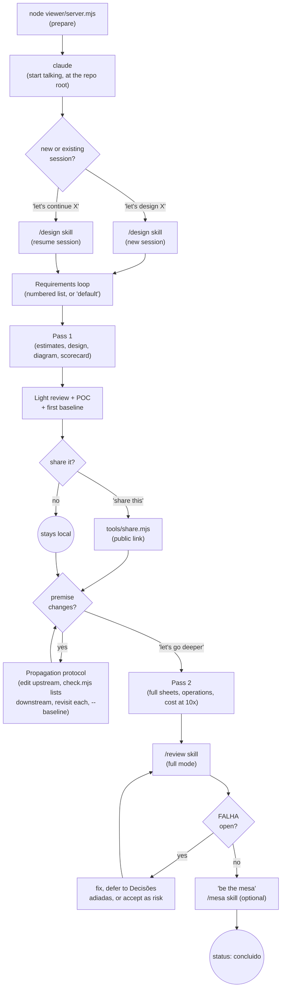

# End-to-end guide

This is the guide for **using** the studio — start to finish, in plain language. `CLAUDE.md` is the instructions that drive the agent; `README.md` is the project overview. If something here and `CLAUDE.md` ever disagree, `CLAUDE.md` is the source of truth — file an issue.

## The flow

## Step by step

Each row: **what you say** (a literal trigger phrase — close is fine, the pilot maps intent, not exact words), **what the pilot does**, **what you see**, **how to get the most out of it**.

1. **Prepare.**
   Say: nothing yet — just run `node viewer/server.mjs` in one terminal and `claude` in another, both from the repo root.
   Pilot does: nothing (no session exists yet).
   You see: an empty panel at http://localhost:4400.
   Get the most: keep the panel open in a second window — it updates itself over SSE, no refresh needed.

2. **Start a session.**
   Say: "let's design a URL shortener" (any system).
   Pilot does: runs `tools/new-session.mjs`, which creates the session skeleton and confirms the viewer is up, in one call.
   You see: a new tab strip in the panel, opening on Problem.
   Get the most: name the system in your first message — there's no skill name to remember or invoke.

3. **Requirements.**
   Say: answer the numbered list the pilot returns — item by item, or just "default" to accept every proposed default, or answer the ones you care about and say "default on the rest".
   Pilot does: persists the list to Requirements as answers come in, closes it in the same turn once every item settles.
   You see: the Requirements tab filling in live, item by item.
   Get the most: item 1 is always the question that changes the system's shape (contention model, fan-out, compliance...) — read that one; the rest genuinely can default.

4. **Pass 1.**
   Say: nothing — this runs automatically once requirements close.
   Pilot does: estimates, the request's story, the diagram, and the scorecard, all in the same turn, going deep only on the 1-2 dominant risks.
   You see: Estimates, Design, Diagram, and Overview tabs light up; everything cut for later shows up as one-line entries under "Decisões adiadas" in Trade-offs.
   Get the most: check the Diagram tab first — it's the fastest way to sanity-check the shape of what got built, and hovering a node shows its sheet (role, cost, failure mode).

5. **Light close and first baseline.**
   Say: nothing — automatic, right after pass 1.
   Pilot does: runs the deterministic lint, reports only the 3-5 failures a sharp reviewer would raise first, writes a POC sketch, records the session's first baseline.
   You see: Review and POC/MVP tabs appear; the pipeline strip's dots turn from dashed (pending) to solid.
   Get the most: this is the point a design becomes shareable — it doesn't need to be finished for that.

6. **Share it (optional).**
   Say: "share this design" (needs `SD_SHARE_BUCKET`/`SD_SHARE_BASE` set — see README's sharing section; without them the pilot tells you what's missing instead of trying).
   Pilot does: calls `tools/share.mjs`, gets back a public link.
   You see: a 🔗 shared badge in the header, linking to a live copy of the same panel.
   Get the most: the page re-publishes itself on every change — no need to re-share after editing further.

7. **A premise changes.**
   Say: "actually, assume 10x the peak load" (or any requirement change, at any point).
   Pilot does: follows the propagation protocol in order — edits only the upstream file, runs `node tools/check.mjs <slug>` and treats its downstream list as the roadmap, works through every file on it (recomputing, or confirming in writing with `--baseline --nota "..."` that it's unaffected), only then records a new baseline.
   You see: the tab strip pulses red for anything stale, clearing again once propagation finishes.
   Get the most: if a tab stays red for more than a turn, ask what's blocking it — that's the protocol's checkpoint working, not a bug.

8. **Pass 2 (optional, on demand).**
   Say: "let's go deeper" / "polish this design".
   Pilot does: fills in full component sheets, complete Operations (deploy, DR, on-call), and cost at 10x for non-linear items.
   You see: richer content in the Diagram tab's legend and the Operations tab.
   Get the most: this is where "what happens at 10x" and "who's on call for this" get real answers — ask for them directly if they're missing.

9. **Full review.**
   Say: "review this design" (it also runs automatically before a session can conclude).
   Pilot does: the `/review` skill's full mode — every one of the 34 guardrails items gets a verdict, `check.mjs --lint`'s findings fold straight in, and each open FALHA gets one concrete fix proposed for you to validate, veto, or accept as a conscious risk.
   You see: the Review tab turns solid once every FALHA is addressed or accepted; the Overview's Guardrails card shows the final PASS/FALHA/N-A/premise/risk counts.
   Get the most: vetoing a fix leaves the item FALHA — accepting it as a risk is a separate, explicit step (it needs an entry in Overview's risks list and a recorded decision in Trade-offs, or it's still just an open FALHA).

10. **Rehearse the defense (optional).**
    Say: "be the mesa" / "I want to rehearse this".
    Pilot does: the `/mesa` skill — a live skeptical reviewer that presses decisions to their consequence, demands the bill for every claim, and attacks whatever's drawn but never verbalized. It doesn't help, doesn't correct, and writes no file.
    You see: nothing written — the whole thing happens in the conversation.
    Get the most: this is what feeds `learnings.md` for next time — a gap that surfaces here is worth an `append` on the spot, and the next session you start prints every open item back to you. "How did I do?" has no separate answer: it's the closing summary `mesa` already gives, in chat.

11. **Conclude.**
    Say: nothing explicit — it happens once the guardrails are clean.
    Pilot does: sets `status: "concluido"` in the session.
    You see: a green "concluido" badge in the header.
    Get the most: a concluded session is still a plain directory of files — reread it later, diff it against a newer design, or hand a reviewer the shared link.

## Signs you're off the rails, and what to do

| Signal | What it means | What to do |
|---|---|---|
| Orange tab | The stage still has the untouched template — it's queued, not started | Normal mid-session; if it lingers past the phase it belongs to, ask the pilot to fill it |
| Red, pulsing tab | An upstream file changed and this one wasn't revisited yet | Run `node tools/check.mjs <slug>` — it lists exactly what's pending, in DAG order |
| Review tab red but not pulsing | The guardrails have an open FALHA | Ask for the review's verdicts; validate, veto, or accept each FALHA as a risk |
| A turn won't end / the hook complains | `check.mjs --hook` found propagation still pending | Read its message — it names the files; work through them and `--baseline` |
| `check.mjs --lint` prints FALHAs/avisos | A deterministic defect in the diagram, scorecard, or trade-offs | Read the `[id]` in the message; `node tools/check.mjs --regras` explains exactly what each one requires |
| Internal jargon shows up in a tab | A command, skill name, or file name ("harness", "check.mjs", "scorecard.json"...) leaked into a `.md` | Ask the pilot to rephrase — session files have to read standalone for a third party |
| Chat keeps asking permission to continue | The pilot is stalling instead of proposing a default and moving on | Say "default" or "go ahead" — the house rule is: propose and proceed, ask only for real open decisions |
| A mitigation sized for more failure than the numbers could ever produce | The design over-engineers relative to its own estimates | Ask "does this match what we estimated?" — `[capacity]`/`[numeros]` in `--lint` catch some of this mechanically |
| A "Defesa em 30s" that doesn't cite this design's numbers | The trade-off reads like it was copied from a different system | Ask for the specific number backing the claim; a number with no unit-backed trace to estimates/requirements is what `[numeros]` flags |

## For maintainers

- **`/harness-eval` evaluates the harness, not the design** — `node tools/eval.mjs <slug>` (deterministic layer) plus a semantic judge reading the artifacts, optionally against a golden session (`--golden <dir>`). Run it after any change to a skill, a template, or a lint predicate.
- **Hooks**: `.claude/settings.json`'s Stop hook runs `node tools/check.mjs --hook` at the end of every turn — it's what makes the propagation protocol non-optional instead of a suggestion.
- **Memory**: `learnings.md` (recurring mistakes) and `padroes.md` (decisions already resolved) are personal and gitignored, but the mechanism that reads and writes them (`tools/learnings.mjs`, `tools/new-session.mjs`) is versioned and tested like any other tool.
- **What's mechanical is the tool's, never hand-typed by the LLM**: session skeletons, stage templates, scorecard patches, and consistency checks all go through `tools/*.mjs`. If you catch the pilot typing out a JSON blob or a file skeleton by hand instead of calling a tool, that's a bug in the skill instructing it, not a one-off mistake to route around.
